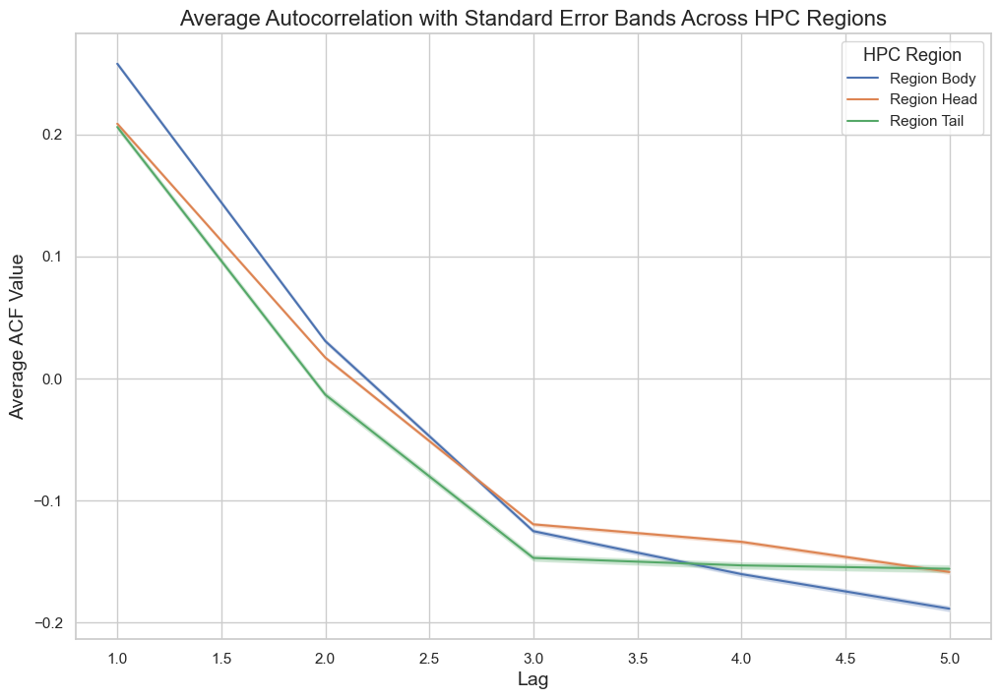
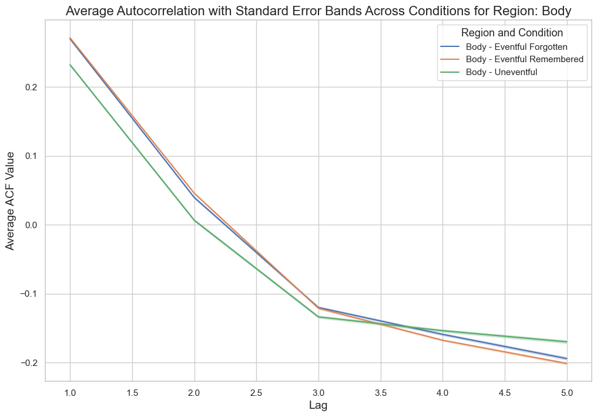

# Hippocampal Autocorrelation Analysis: Encoding Eventful vs. Uneventful Episodes

### Overview
This project investigates how the subregions of the human hippocampus (head, body, and tail) encode different types of visual experiences. The primary objective was to identify differences in hippocampal temporal dynamics—measured via single-voxel autocorrelations—when individuals watch eventful versus uneventful video episodes, and whether those episodes are subsequently remembered or forgotten.

### The Data
The analysis is based on 7T functional Magnetic Resonance Imaging (fMRI) data collected from 16 participants. Participants watched 8-second silent video clips, followed by a 22-second odd/even judgment task. A recall test administered 24 hours later classified the eventful episodes as either "remembered" or "forgotten". 

*Note: Due to privacy restrictions and large file sizes, the raw `.mat` fMRI data files are kept locally and are not included in this repository.*

### Methodology
To analyze the event segmentation and temporal dependencies, the following data pipeline was built using Python:
* **Data Parsing:** Processed the fMRI time-series data (TR = 2s) using `pandas`, `numpy`, and `scipy`.
* **Segmentation:** Segmented the BOLD signal based on event onset, capturing the 8-second episode plus 20 seconds of the subsequent consolidation period.

* **Autocorrelation:** Calculated single-voxel autocorrelations up to a lag of 5 using `statsmodels` to assess the persistence and temporal timescales of the neural signal across regions.
* **Visualization:** Visualized the autocorrelation distributions, condition comparisons, and temporal decay across the head, body, and tail of the hippocampus using `seaborn` and `matplotlib`.

### Key Findings
* **General Temporal Dynamics:** All hippocampal subregions exhibited significantly positive autocorrelations at early lags, which decayed into lower or negative autocorrelations at later lags.
* **Regional Differences:** The body of the hippocampus demonstrated the highest average autocorrelation at lag 1, suggesting it plays a highly integrative role in event segmentation. 

* **Sensitivity to Eventfulness:** Eventful episodes elicited significantly higher positive autocorrelations at lags 1 and 2 compared to uneventful stimuli. This indicates a stronger, more persistent neural signal over the first 4 seconds of processing meaningful events.

* **Memory Retention:** There was no statistically significant difference in autocorrelations between eventful episodes that were remembered versus those that were forgotten. This suggests that while the hippocampus is sensitive to event boundaries during initial encoding, other factors and downstream consolidation processes likely determine ultimate memory retention.