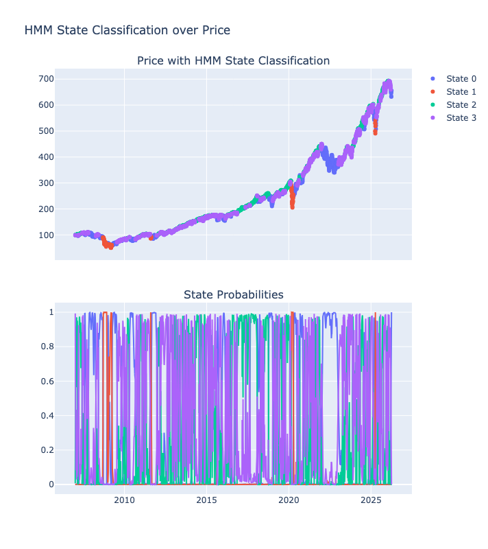
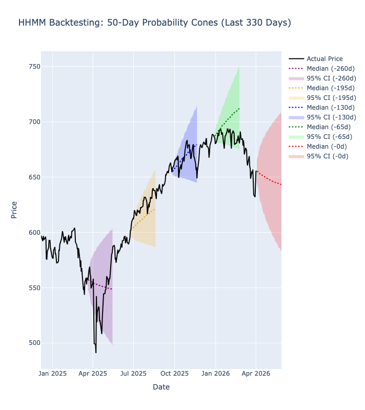

# Deep Dive: HHMM Architecture & Market Regime Forecasting

This document provides a technical breakdown of the Hierarchical Hidden Markov Model (HHMM) built for this project, detailing its mathematical foundations and how to interpret its key visual outputs.

## 1. The Model Architecture
Financial markets do not operate in a single state; they shift between discrete, unobservable "regimes" (e.g., high-volatility bear markets, low-volatility bull markets, sideways consolidation). 

While a standard Hidden Markov Model (HMM) can attempt to cluster these states, it lacks the depth to understand macro-to-micro relationships. This project utilizes a **Hierarchical HMM**, which models the market using a tree structure of nested states. 

* **Macro Regimes (Parents):** Representing long-term market environments (e.g., a multi-year economic expansion).
* **Micro Regimes (Siblings):** Representing shorter-term structural shifts within that parent regime (e.g., a localized 2-week volatility spike within a broader bull market).

The model is trained entirely from scratch using the **Expectation-Maximization (EM)** algorithm, specifically implementing a custom, multi-layered Forward-Backward (Baum-Welch) process to recursively estimate the transition matrices, initial probabilities, and emission distributions (Gaussian) of the log-returns.

## Automated Model Selection: Architecture & Distribution

To ensure the model captures true underlying market regimes without overfitting to historical noise, this project utilizes an automated architecture search. The model evaluates various tree depths, sibling counts, and emission distributions, scoring them using the **Akaike Information Criterion (AIC)** and **Bayesian Information Criterion (BIC)**.

| Rank | Architecture | Distribution | Total States | Parameters ($k$) | Log-Likelihood | AIC | BIC | Time (s) |
| :--- | :--- | :--- | :--- | :--- | :--- | :--- | :--- | :--- |
| **1** | **[2, 2]** | **Laplace** | **4** | **23** | **-15457.70** | **30961.41** | **31110.15** | **20.17** |
| 2 | [3, 2] | Laplace | 6 | 38 | -15469.99 | 31015.99 | 31261.75 | 24.27 |
| 3 | [2, 2] | Gaussian | 4 | 23 | -15539.82 | 31125.64 | 31274.39 | 22.99 |
| 4 | [2, 3] | Laplace | 6 | 39 | -15472.29 | 31022.59 | 31274.82 | 20.59 |
| 5 | [3, 2] | Gaussian | 6 | 38 | -15612.10 | 31300.21 | 31545.97 | 26.54 |
| 6 | [2, 3] | Gaussian | 6 | 39 | -15622.56 | 31323.12 | 31575.35 | 22.64 |

### Key Empirical Insights

**1. The Reality of "Fat Tails" (Laplace vs. Gaussian)**
In standard statistical models, financial log-returns are often assumed to be normally distributed (Gaussian). However, real-world markets experience extreme outlier events (crashes and surges) much more frequently than a standard bell curve predicts. 

* **The Result:** The Laplace distribution, which features mathematically "fatter tails" via Mean Absolute Deviation (MAD), vastly outperformed the Gaussian distribution across every single architectural variation. The algorithm empirically proved that S&P 500 returns do not follow a normal distribution.

**2. Occam's Razor & Overfitting (AIC / BIC Penalties)**
When building Hierarchical HMMs, it is tempting to continually add hidden states to capture more market nuance. However, every new parent/sibling node exponentially increases the number of free parameters ($k$) required for the transition and emission matrices.
* **The Result:** The simplest architecture tested (`[2, 2]` with 4 total states and 23 parameters) was the definitive winner. The more complex `[3, 2]` model increased the parameter count to 38, but failed to improve the Log-Likelihood enough to justify the added complexity. 
* **The Selection:** By selecting the model with the lowest **BIC** (which penalizes complexity more aggressively than AIC), the pipeline automatically protects the forecasting engine from memorizing historical noise, ensuring the resulting probability cones remain highly generalized for future, unseen data.

---

## 2. Decoding the Posterior Probabilities Plot

The Posterior Probabilities plot represents the model's internal "belief system" at any given point in time. 

Because the market regimes are *hidden*, the model can never be 100% certain which state it is in. Instead, it calculates a posterior probability distribution across all possible bottom-level states for every single day in the historical dataset.

<!-- ===================================================================== -->
<!-- INSERT POSTERIOR PLOT HERE -->

*(Note: Save the bottom half of your Plotly state classification chart as an image and place it in the `images/` folder with this name).*
<!-- ===================================================================== -->

### How to read this chart:
* **The Y-Axis (0 to 1.0):** Represents absolute probability. If a single line hits 1.0, the model is absolutely certain the market is in that specific regime.
* **Rapid Oscillations:** During periods of extreme market stress or structural transitions, you will see multiple state lines fluctuating wildly. This indicates the market is behaving erratically and the model is rapidly adjusting its probabilities as the micro-regimes fight for dominance.
* **Sustained Plateaus:** When a single line holds near 1.0 for an extended period, it indicates a highly stable market regime (often a strong, low-volatility bull trend). 

---

## 3. Decoding the Historical Probability Cones (Backtesting)

To validate the predictive power of the model, we must test its forecasting accuracy against unseen historical data. The Historical Probability Cone chart is a backtesting visualization that projects 50-day forecasts from various points in the past to see if the *actual* realized price stayed within the model's calculated bounds.

Instead of a simple standard deviation calculation, these cones are generated through **mathematical convolutions**. The model simulates the future by convolving the mixture densities of the forecasted states day-by-day, accounting for the expanding variance over time.

<!-- ===================================================================== -->
<!-- INSERT HISTORICAL CONE PLOT HERE -->

*(Note: Save the overlapping backtest cone chart as an image and place it in the `images/` folder with this name).*
<!-- ===================================================================== -->

### How to read this chart:
* **The Colored Cones (95% Confidence Interval):** Each colored shaded area represents a 40-day projection generated from a specific historical date. The model is stating that there is a 95% statistical probability that the price will remain within this cone.
* **The Dotted Median Line:** The expected trajectory of the price based on the weighted means of the forecasted states. Notice how the median will dynamically curve upward or downward depending on whether the model detected a bullish or bearish regime on the day the forecast was generated.
* **The Solid Black Line (Actual Price):** This is the ground truth. If the model is properly calibrated, the solid black line should remain inside the colored bounds roughly 95% of the time, and "breakouts" should be exceptionally rare.

---

## 4. Technical Summary
* **Initialization:** Recursive nested dictionary structures for $D$-depth architecture.
* **Distributions:** Gaussian emission parameters dynamically initialized via percentiles and standard deviations of historical log-returns.
* **Forecasting Engine:** Multi-step probability matrix multiplication resolving parent-sibling transition and termination probabilities to project state weights into the future.